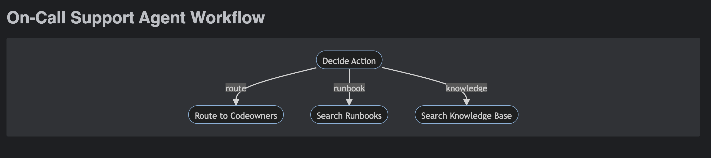

## Clean up old virtual environments

```commandline
deactivate
rm -rf venv
```


## Setup new virtual environment
```commandline
python3 -m venv venv
source venv/bin/activate
pip install -r requirements.txt
```

## Start the app

```commandline
uvicorn app:app --reload
```

## Model

```commandline
Ollama
https://github.com/ollama/ollama

ollama run llama3.2

ollama show llama3.2
  Model
    architecture        llama
    parameters          3.2B
    context length      131072
    embedding length    3072
    quantization        Q4_K_M

  Parameters
    stop    "<|start_header_id|>"
    stop    "<|end_header_id|>"
    stop    "<|eot_id|>"

  License
    LLAMA 3.2 COMMUNITY LICENSE AGREEMENT
    Llama 3.2 Version Release Date: September 25, 2024


```

## Workflow




